# OpsGuardian™

<div align="center">

[](LICENSE)
[](https://developer.salesforce.com)
[](.github/workflows)
[](.)

**Enterprise-grade Salesforce monitoring and compliance framework**

[Features](#features) • [Installation](#installation) • [Quick Start](#quick-start) • [Documentation](#documentation) • [Support](#support)

</div>

---

## Overview

OpsGuardian™ is a comprehensive Salesforce-native monitoring and compliance framework designed for regulated industries. It provides real-time observability, AI-powered diagnostics, and automated remediation to help organizations maintain compliance, prevent outages, and scale securely.

### Why OpsGuardian?

- **Real-Time Monitoring**: Track governor limits, Flow execution, API usage, and system performance
- **AI-Powered Insights**: Leverage Einstein and external LLMs for intelligent diagnostics
- **Compliance-Ready**: Built for GDPR, SOC 2, HIPAA with Shield Platform Encryption
- **Enterprise Scale**: Hub-and-spoke architecture for multi-org telemetry aggregation
- **Extensible**: Plugin SDK for Slack, Jira, webhooks, and custom integrations

---

## Features

### 🔍 Observability

- **Governor Limit Monitoring**: Real-time tracking of CPU time, heap size, SOQL/DML limits
- **Flow Execution Tracking**: Monitor Flow runs, detect faults, analyze performance
- **API Usage Analytics**: Track API consumption and predict exhaustion
- **Deployment Monitoring**: Track deployment jobs, test results, and deployment metrics

### 🤖 AI Diagnostics

- Einstein Prediction Builder integration
- External LLM support (GPT, Claude, etc.) via Named Credentials
- Automated root cause analysis
- Smart remediation recommendations

### 🛡️ Security & Compliance

- **Shield Platform Encryption**: Encrypt data at rest
- **CRUD/FLS Enforcement**: `WITH SECURITY_ENFORCED` on all queries
- **Audit Trails**: Tamper-evident logs with correlation IDs
- **Data Retention**: Configurable retention policies (default 180 days)
- **Multi-Org Isolation**: Segregated data access per organization

### 🔔 Alerting & Automation

- **Platform Events**: Real-time event streaming
- **Multi-Channel Alerts**: Slack, Jira, webhooks, custom integrations
- **Automated Remediation**: Trigger Flows or custom Apex on threshold breaches
- **Escalation Policies**: Configurable alert routing and escalation

### 📊 Dashboards

- **Lightning Web Components**: Modern, responsive UI tiles
- **Real-Time Data**: Auto-refreshing dashboards with visibility state management
- **Performance Optimized**: LDS caching, exponential backoff, efficient polling

---

## Tech Stack

| Component | Technology |
|-----------|-----------|
| **Platform** | Salesforce (Lightning, Apex, LWC) |
| **Package Type** | Second-Generation Managed Package (2GP) |
| **API Version** | 62.0+ |
| **AI Integration** | Einstein + External LLMs (OAuth JWT) |
| **Security** | Shield Platform Encryption, CRUD/FLS enforcement |
| **Integrations** | Platform Events, REST APIs, Named Credentials |
| **DevOps** | Salesforce CLI, GitHub Actions, ESLint, Prettier |
| **Testing** | Apex Tests (95%+ coverage), Jest for LWC |

---

## Architecture

```mermaid
flowchart TB
    subgraph "Salesforce Org"
        LWC[OpsGuardian LWC]
        APEX[Apex Services]
        DATA[(OpsGuardian Data)]
        EVENTS[Platform Events]
        CMDT[Custom Metadata]

        LWC --> APEX
        APEX --> DATA
        APEX --> EVENTS
        APEX --> CMDT
    end

    subgraph "External Systems"
        AI[AI Services]
        SLACK[Slack]
        JIRA[Jira]
        ORGS[Other Orgs]
    end

    APEX -->|Named Credential| AI
    EVENTS --> SLACK
    EVENTS --> JIRA
    APEX -->|REST API| ORGS

    style LWC fill:#1798c1
    style APEX fill:#00a1e0
    style DATA fill:#032d60
    style EVENTS fill:#ea8e1e
```



### Key Components

1. **OpsGuardian LWC Tiles**: Real-time dashboard components
2. **Apex Services**: Core business logic, API integrations
3. **Custom Objects**: `OpsGuardian_History__c`, `Flow_Execution__c`, `API_Usage_Snapshot__c`
4. **Platform Events**: `Performance_Alert__e` for real-time alerting
5. **Custom Metadata**: `OG_Policy__mdt` for configurable thresholds

---

## Installation

### Prerequisites

- Salesforce CLI (`sf` or `sfdx`)
- Dev Hub enabled
- Node.js 18+ (for local development)

### Option 1: Scratch Org (Development)

```bash
# Authenticate to your Dev Hub
sf org login web --set-default-dev-hub --alias DevHub

# Create scratch org
sf org create scratch --definition-file config/project-scratch-def.json \
  --alias OpsGuardian --duration-days 7 --set-default

# Push source
sf project deploy start

# Assign permission set
sf org assign permset --name OpsGuardian_Admin

# Open org
sf org open --path /lightning/app/OpsGuardian
```

### Option 2: Sandbox/Production

1. Install the managed package:
   ```
   https://login.salesforce.com/packaging/installPackage.apexp?p0=04t...
   ```

2. Assign the `OpsGuardian_Admin` permission set to administrators

3. Configure thresholds in Setup → Custom Metadata Types → `OG_Policy__mdt`

4. (Optional) Configure Named Credentials for AI integration and external webhooks

---

## Quick Start

### 1. Configure Policies

Navigate to **Setup → Custom Metadata Types → OG Policy** and create threshold policies:

| Field | Example Value | Description |
|-------|--------------|-------------|
| CPU_Warn__c | 5000 | CPU time warning (ms) |
| CPU_Crit__c | 8000 | CPU time critical (ms) |
| SOQL_Warn__c | 80 | SOQL query warning |
| SOQL_Crit__c | 95 | SOQL query critical |

### 2. Set Up Alerting

Configure Slack webhook:

1. **Setup → Named Credentials → New**
2. Create `Slack_Webhook` with your Slack webhook URL
3. Test with: `SlackNotifier.notifyAsync('Test message')`

### 3. View Dashboards

Open the **OpsGuardian** Lightning app to access:

- API Usage Dashboard
- Flow Execution Monitor
- System Performance Dashboard
- Deployment Monitor
- Performance Alert Panel

### 4. Monitor Events

Query operational events:

```sql
SELECT Event_Type__c, Severity__c, Message__c, Timestamp__c
FROM OpsGuardian_History__c
WHERE Severity__c = 'Critical'
ORDER BY Timestamp__c DESC
LIMIT 50
```

---

## Configuration

### Custom Metadata (Policies)

Configure monitoring thresholds via **OG_Policy__mdt**:

```apex
// Example: Get current settings
CCX_Settings__c settings = CCX_Settings__c.getInstance();
Integer cpuWarn = settings.CPU_Warn__c?.intValue();
```

### Named Credentials (AI Integration)

1. **Setup → Named Credentials → External Credentials**
2. Create `OG_AI` with JWT Bearer flow
3. Configure endpoint URL for your AI service
4. Assign principal to `OpsGuardian_Admin` permission set

### Platform Events

Subscribe to `Performance_Alert__e` for real-time alerts:

```apex
trigger PerformanceAlertTrigger on Performance_Alert__e (after insert) {
    for (Performance_Alert__e evt : Trigger.new) {
        if (evt.Severity__c == 'Critical') {
            SlackNotifier.notifyPerformanceEvent(evt);
        }
    }
}
```

---

## API Reference

### Ingest API (Hub-and-Spoke)

Send telemetry from spoke orgs to a central hub:

**Endpoint**: `/services/apexrest/og/v1/ingest`

**Method**: `POST`

**Authentication**: JWT Bearer token

**Request Body**:
```json
{
  "type": "CPU",
  "message": "CPU limit breach in after-insert trigger",
  "severity": "Critical",
  "timestamp": "2025-01-15T10:30:00Z",
  "correlationId": "a1b2c3d4"
}
```

**Example**:
```bash
curl -X POST "$SF_URL/services/apexrest/og/v1/ingest" \
  -H "Authorization: Bearer $JWT" \
  -H "Content-Type: application/json" \
  -d '{
    "type": "CPU",
    "message": "CPU limit exceeded",
    "severity": "Critical",
    "timestamp": "2025-01-15T10:30:00Z"
  }'
```

**Responses**:
- `201 Created`: Event ingested successfully
- `400 Bad Request`: Invalid payload
- `401 Unauthorized`: Invalid or missing JWT
- `429 Too Many Requests`: Rate limit exceeded (includes `Retry-After` header)

---

## Plugin SDK

Extend OpsGuardian with custom integrations:

### Plugin Interface

```apex
public interface OG_Plugin {
    void send(OpsGuardian_History__c eventRec);
    Boolean supports(String eventType, String severity);
}
```

### Example Plugin

```apex
public class MyCustomPlugin implements OG_Plugin {
    public void send(OpsGuardian_History__c eventRec) {
        // Send to external system
        HttpRequest req = new HttpRequest();
        req.setEndpoint('callout:MyWebhook');
        req.setMethod('POST');
        req.setBody(JSON.serialize(eventRec));
        new Http().send(req);
    }

    public Boolean supports(String eventType, String severity) {
        return severity == 'Critical';
    }
}
```

### Register Plugin

1. Create Custom Metadata record: `OG_Plugin_Config__mdt`
2. Set `Class_Name__c` to `MyCustomPlugin`
3. Configure filters (event types, severities)

---

## Development

### Local Setup

```bash
# Clone repository
git clone https://github.com/derickporter1993/Ops-Guardian.git
cd Ops-Guardian

# Install dependencies
npm install

# Run tests
npm test

# Lint & format
npm run lint
npm run fmt
```

### Running Tests

```bash
# Apex tests
sf apex run test --test-level RunLocalTests --code-coverage --result-format human

# LWC tests (if configured)
npm run test:unit

# Static analysis
sf scanner run --target force-app --format table
```

### Code Quality

- **ESLint**: Configured with `@lwc/eslint-plugin-lwc` and Babel parser
- **Prettier**: Auto-formatting for JS, HTML, JSON, YAML, Markdown
- **Salesforce Code Analyzer**: PMD + security rules
- **Coverage Target**: 95%+ for Apex

---

## Security

### Threat Model

OpsGuardian follows security best practices:

| Threat | Mitigation |
|--------|-----------|
| **Spoofing** | JWT validation, audience checks |
| **Tampering** | `WITH SECURITY_ENFORCED`, `Security.stripInaccessible()` |
| **Repudiation** | Append-only logs with correlation IDs |
| **Information Disclosure** | CRUD/FLS enforcement, Shield encryption |
| **DoS** | Rate limiting (429 responses), Platform Cache |
| **Elevation of Privilege** | Least-privilege permission sets, `with sharing` |

### Data Privacy

- **Encryption**: Shield Platform Encryption at rest, TLS 1.3 in transit
- **Retention**: Default 180 days, configurable per policy
- **Erasure**: Admin-initiated deletion via Flow, batch anonymization
- **Compliance**: GDPR, SOC 2, HIPAA-ready patterns

### Reporting Vulnerabilities

Report security issues via [GitHub Security Advisories](https://github.com/derickporter1993/Ops-Guardian/security/advisories).

**Do not file public issues for security vulnerabilities.**

---

## Compliance & Regulatory

OpsGuardian is designed from the ground up for regulated industries. Compliance isn't an add-on—it's built into every layer of the system.

### Why Compliance Matters

Organizations in regulated industries face strict requirements:

| Industry | Regulations | Requirements |
|----------|-------------|--------------|
| **Financial Services** | SOX, PCI-DSS | Transaction audit trails, segregation of duties |
| **Healthcare** | HIPAA, HITECH | PHI encryption, access controls, breach notification |
| **Government** | FedRAMP, FISMA | Security controls, continuous monitoring |
| **All EU Business** | GDPR | Data privacy, right to erasure, breach notification |
| **Enterprise SaaS** | SOC 2, ISO 27001 | Security audits, incident response |

**The Stakes:**
- **GDPR violations**: Up to €20M or 4% of annual revenue
- **HIPAA violations**: Up to $1.5M per violation category per year
- **SOX violations**: Criminal penalties, delisting from exchanges
- **Reputation damage**: Lost customer trust, competitive disadvantage

---

### Core Compliance Features

#### 1. Tamper-Evident Audit Trail 🔒

**What It Provides:**
Every system event is logged in an immutable, encrypted record that regulators can trust.

**Implementation:**
```apex
// Automatic audit logging
OpsGuardian_History__c auditLog = new OpsGuardian_History__c(
    Event_Type__c = 'DATA_ACCESS',
    User__c = UserInfo.getUserName(),
    Action__c = 'READ',
    Record_Id__c = 'a015g00000ABC123',
    Timestamp__c = DateTime.now(),
    Correlation_Id__c = 'trace-xyz-789',
    Source_Org_Id__c = UserInfo.getOrganizationId(),
    Details__c = 'Patient record accessed via API'
);
// Encrypted with Shield Platform Encryption
// Append-only design prevents tampering
insert auditLog;
```

**What Regulators See:**
```
Event Timeline for Incident #2025-001:
├─ 2025-01-15 14:23:45 UTC - API authentication attempt (SUCCESS)
├─ 2025-01-15 14:23:46 UTC - User admin@company.com accessed Patient_Record__c
├─ 2025-01-15 14:23:47 UTC - Data export initiated (147 records)
├─ 2025-01-15 14:24:00 UTC - Anomaly detected (unusual access pattern)
├─ 2025-01-15 14:24:05 UTC - Alert sent to security team
└─ 2025-01-15 14:27:00 UTC - Session terminated by admin
```

**Benefits:**
- ✅ **Complete visibility**: Every action logged
- ✅ **Chronological order**: Timestamp-based reconstruction
- ✅ **Cross-system tracing**: Correlation IDs link distributed events
- ✅ **Tamper-proof**: Shield encryption + append-only design

---

#### 2. Data Retention & Right to Erasure (GDPR/CCPA) 📅

**Automatic Retention Management:**

Configure retention policies in Custom Metadata:

```apex
// OG_Policy__mdt settings
Retention_Period__c = 180         // Default: 6 months
Critical_Retention__c = 365        // Critical logs: 1 year
Info_Retention__c = 90             // Info logs: 3 months
Auto_Purge_Enabled__c = true      // Automatic cleanup
```

**Scheduled Batch Deletion:**
```apex
// Runs nightly at 2:00 AM
global class DataRetentionBatch implements Database.Batchable<sObject> {
    global Database.QueryLocator start(Database.BatchableContext bc) {
        Date cutoffDate = Date.today().addDays(-180);
        return Database.getQueryLocator([
            SELECT Id FROM OpsGuardian_History__c
            WHERE CreatedDate < :cutoffDate
            AND Severity__c != 'Critical'
        ]);
    }

    global void execute(Database.BatchableContext bc, List<sObject> scope) {
        delete scope;
    }
}
```

**GDPR Right to Erasure (Article 17):**

When a customer requests data deletion:

1. **Search**: Find all records related to the customer
2. **Anonymize**: Replace PII with generic identifiers
3. **Delete**: Remove actual customer data
4. **Certify**: Generate deletion certificate

```apex
// Example: Customer deletion request
public class GDPRDeletionService {
    public static void processErasureRequest(Id customerId) {
        // Step 1: Find all related records
        List<OpsGuardian_History__c> records = [
            SELECT Id, Details__c, User__c
            FROM OpsGuardian_History__c
            WHERE Customer_Id__c = :customerId
        ];

        // Step 2: Anonymize (keep statistics, remove identity)
        for (OpsGuardian_History__c rec : records) {
            rec.Details__c = 'Customer data anonymized per GDPR request';
            rec.User__c = 'ANONYMIZED-USER-' + rec.Id.to15();
            rec.Customer_Id__c = null;
        }
        update records;

        // Step 3: Delete actual customer data from other objects
        delete [SELECT Id FROM Customer__c WHERE Id = :customerId];

        // Step 4: Log the deletion (for audit)
        insert new OpsGuardian_History__c(
            Event_Type__c = 'GDPR_ERASURE',
            Severity__c = 'Info',
            Message__c = 'Customer data erased per GDPR Article 17',
            Timestamp__c = DateTime.now()
        );
    }
}
```

**Retention Dashboard:**
```
Data Retention Status:
├─ Total Records: 1,247,893
├─ Eligible for Deletion: 23,456 (older than 180 days)
├─ Critical Records Retained: 8,921 (policy exemption)
├─ Next Purge Scheduled: 2025-01-16 02:00 AM
└─ Compliance Status: ✅ 98.2% compliant
```

---

#### 3. Encryption at Rest & In Transit 🔐

**Shield Platform Encryption:**

All sensitive data encrypted at the database level:

```apex
// Encrypted fields (transparent to code)
OpsGuardian_History__c record
├── Message__c         (ENCRYPTED with AES-256)
├── Details__c         (ENCRYPTED with AES-256)
├── User__c            (ENCRYPTED with AES-256)
├── Source_Org_Id__c   (ENCRYPTED with AES-256)
└── Customer_Id__c     (ENCRYPTED with AES-256)
```

**Key Management:**
- Keys managed by Salesforce KMS (Key Management Service)
- Automatic key rotation per Salesforce policy
- Keys never exposed to application code
- Separate tenant key spaces (multi-tenant isolation)

**Transport Security:**
```
All communications encrypted with:
├─ TLS 1.3 (latest protocol)
├─ Perfect Forward Secrecy (PFS)
├─ Certificate pinning for Named Credentials
└─ JWT tokens (OAuth 2.0) for API authentication
```

**Compliance Mapping:**
- ✅ **HIPAA**: PHI encrypted per 164.312(a)(2)(iv)
- ✅ **PCI-DSS**: Cardholder data encryption (Requirement 3.4)
- ✅ **GDPR**: Security of processing (Article 32)
- ✅ **SOC 2**: Encryption controls (CC6.7)

---

#### 4. Access Control & Segregation 👥

**Multi-Level Security Model:**

```
┌─────────────────────────────────────────┐
│  Permission Set: OpsGuardian_Admin      │
│  - Full CRUD on all objects             │
│  - Export audit logs                    │
│  - Configure policies                   │
└─────────────────────────────────────────┘
         │
         ├─────────────────────────────────┐
         │                                 │
┌────────▼──────────┐      ┌──────────────▼─────────┐
│ OpsGuardian_User  │      │ OpsGuardian_Auditor    │
│ - Read dashboards │      │ - Read-only logs       │
│ - View alerts     │      │ - Export reports       │
│ - No admin access │      │ - No modifications     │
└───────────────────┘      └────────────────────────┘
```

**Record-Level Security (RLS):**
```apex
// WITH SECURITY_ENFORCED enforces sharing rules
SELECT Id, Message__c, Severity__c
FROM OpsGuardian_History__c
WHERE Source_Org_Id__c = :UserInfo.getOrganizationId()
WITH SECURITY_ENFORCED  // Respects user permissions
LIMIT 100
```

**Field-Level Security (FLS):**
```apex
// Strip inaccessible fields before returning data
public static List<OpsGuardian_History__c> getAuditLogs() {
    List<OpsGuardian_History__c> records = [
        SELECT Id, Event_Type__c, Message__c, User__c, Timestamp__c
        FROM OpsGuardian_History__c
        LIMIT 1000
    ];

    SObjectAccessDecision decision = Security.stripInaccessible(
        AccessType.READABLE,
        records
    );

    return decision.getRecords();  // Only accessible fields returned
}
```

**Multi-Org Data Segregation:**
```apex
// Hub-and-spoke architecture with strict isolation
// US Production org
WHERE Source_Org_Id__c = '00D5g000000abcdXXX'

// EU Production org (separate data)
WHERE Source_Org_Id__c = '00D5g000000efghYYY'

// No cross-org data leakage possible
```

---

#### 5. Incident Response & Forensics 🔍

**Complete Timeline Reconstruction:**

```sql
-- Recreate entire incident from audit logs
SELECT
    Timestamp__c,
    Event_Type__c,
    User__c,
    Action__c,
    Message__c,
    Correlation_Id__c
FROM OpsGuardian_History__c
WHERE Correlation_Id__c = 'incident-2025-01-15-security-breach'
ORDER BY Timestamp__c ASC
```

**Output:**
```
Incident #2025-001 Timeline:
───────────────────────────────────────────────────────────────
14:23:30 | API_AUTH     | user@external.com    | LOGIN_ATTEMPT
14:23:45 | API_AUTH     | user@external.com    | LOGIN_SUCCESS
14:23:50 | DATA_ACCESS  | user@external.com    | READ Patient_Record__c
14:24:05 | DATA_EXPORT  | user@external.com    | EXPORT 147 records
14:24:10 | ANOMALY      | SYSTEM               | Unusual access pattern detected
14:24:15 | ALERT        | SYSTEM               | SecurityTeam notified
14:25:00 | ADMIN_ACTION | admin@company.com    | Session terminated
14:25:30 | ADMIN_ACTION | admin@company.com    | User deactivated
14:26:00 | REMEDIATION  | admin@company.com    | API keys rotated
───────────────────────────────────────────────────────────────
Total Duration: 2 minutes 30 seconds
Records Accessed: 147
Containment Time: 105 seconds
```

**Incident Report Generation:**

```apex
// Generate compliance report for incident
public class IncidentReportGenerator {
    public static void generateReport(String correlationId) {
        // Query all related events
        List<OpsGuardian_History__c> events = [
            SELECT Timestamp__c, Event_Type__c, User__c, Message__c
            FROM OpsGuardian_History__c
            WHERE Correlation_Id__c = :correlationId
            ORDER BY Timestamp__c
        ];

        // Build report
        String report = 'INCIDENT REPORT\n';
        report += '================\n';
        report += 'Incident ID: ' + correlationId + '\n';
        report += 'Date: ' + events[0].Timestamp__c.format() + '\n';
        report += 'Total Events: ' + events.size() + '\n\n';
        report += 'TIMELINE:\n';

        for (OpsGuardian_History__c evt : events) {
            report += evt.Timestamp__c.format('HH:mm:ss') + ' | ';
            report += evt.Event_Type__c + ' | ';
            report += evt.Message__c + '\n';
        }

        // Create PDF and email to compliance team
        // ... implementation
    }
}
```

**GDPR Article 33 Compliance:**

OpsGuardian helps meet the 72-hour breach notification requirement:

1. **Detection** (automated): Anomaly detected within seconds
2. **Alerting** (automated): Security team notified immediately
3. **Investigation** (manual): Team reviews audit logs
4. **Report Generation** (automated): Click-button incident report
5. **Submission** (manual): Submit to data protection authority

**Total Time**: Hours instead of days

---

#### 6. Compliance Reports & Audit Export 📊

**Pre-Built Compliance Reports:**

| Report Name | Purpose | Regulation |
|-------------|---------|------------|
| **User Access Report** | Who accessed what data | HIPAA, GDPR |
| **Admin Activity Log** | Privileged actions audit | SOX, SOC 2 |
| **Data Modification Trail** | All create/update/delete operations | SOX, PCI-DSS |
| **Failed Login Attempts** | Security monitoring | ISO 27001 |
| **Data Export Log** | Track data leaving the system | GDPR |
| **Retention Compliance** | Data aging and deletion proof | GDPR, CCPA |

**Export Formats:**

```bash
# Export for auditors (CSV)
sf data export bulk \
  --query "SELECT * FROM OpsGuardian_History__c
           WHERE CreatedDate >= 2025-01-01T00:00:00Z" \
  --output-file audit-export-2025-Q1.csv

# Encrypted export (for regulators)
openssl enc -aes-256-cbc \
  -in audit-export-2025-Q1.csv \
  -out audit-export-2025-Q1.csv.enc \
  -pass pass:SecurePassword123

# JSON export (for SIEM integration)
sf data export --format json --query "..." > events.json
```

**Real-Time Compliance Dashboard:**

```
╔══════════════════════════════════════════════════╗
║       COMPLIANCE STATUS DASHBOARD                ║
╠══════════════════════════════════════════════════╣
║                                                  ║
║  📊 Data Retention                               ║
║    ✅ 98.7% compliant (1,234 of 1,250 records)  ║
║    ⚠️  16 records require review                ║
║                                                  ║
║  🔐 Encryption Status                            ║
║    ✅ 100% of sensitive fields encrypted        ║
║    ✅ Shield Platform Encryption: ACTIVE        ║
║                                                  ║
║  🔒 Access Violations (Last 30 Days)             ║
║    ⚠️  3 attempted unauthorized access          ║
║    ✅ All incidents resolved                     ║
║                                                  ║
║  📋 Audit Readiness                              ║
║    ✅ Audit logs: 1,247,893 records             ║
║    ✅ Retention policy: CONFIGURED               ║
║    ✅ Export capability: TESTED                  ║
║                                                  ║
║  🎯 Overall Compliance Score: 99.2% ✅           ║
║                                                  ║
╚══════════════════════════════════════════════════╝
```

---

### Regulatory Compliance Matrix

| Regulation | Requirement | OpsGuardian Feature | Status |
|------------|-------------|---------------------|---------|
| **GDPR** | Right to access | Audit log export | ✅ |
| **GDPR** | Right to erasure | Automated deletion | ✅ |
| **GDPR** | Breach notification (72h) | Real-time alerts | ✅ |
| **GDPR** | Data encryption | Shield encryption | ✅ |
| **HIPAA** | PHI encryption | Shield encryption | ✅ |
| **HIPAA** | Access controls | Permission sets + FLS | ✅ |
| **HIPAA** | Audit trails | Complete event logging | ✅ |
| **SOC 2** | Security monitoring | Real-time dashboards | ✅ |
| **SOC 2** | Incident response | Automated alerting | ✅ |
| **SOC 2** | Change management | Deployment tracking | ✅ |
| **SOX** | Segregation of duties | Permission sets | ✅ |
| **SOX** | Transaction audit | Complete audit trail | ✅ |
| **PCI-DSS** | Cardholder data encryption | Shield encryption | ✅ |
| **PCI-DSS** | Access logging | User activity tracking | ✅ |

---

### Real-World Compliance Scenarios

#### Scenario 1: SOC 2 Type II Audit

**Auditor Request:**
> "Show me all privileged access to production systems in Q4 2024"

**Your Response:**
```sql
-- Run query (takes 10 seconds)
SELECT User__c, Action__c, Timestamp__c, Details__c
FROM OpsGuardian_History__c
WHERE Event_Type__c = 'ADMIN_ACCESS'
  AND CreatedDate >= 2024-10-01T00:00:00Z
  AND CreatedDate < 2025-01-01T00:00:00Z
ORDER BY Timestamp__c
```

**Export to CSV** → Email to auditor → **Done in 5 minutes**

**Without OpsGuardian:** Manually search logs for weeks ❌

---

#### Scenario 2: GDPR Data Erasure Request

**Customer Request:**
> "Delete all my personal data per GDPR Article 17"

**OpsGuardian Workflow:**
1. Click "Process GDPR Deletion Request"
2. Enter customer ID
3. System finds all related records (2 seconds)
4. Anonymize audit logs (preserves statistics)
5. Delete actual customer data
6. Generate deletion certificate
7. Email confirmation to customer

**Total Time:** 15 minutes
**Manual Process:** 2-3 days ❌

---

#### Scenario 3: HIPAA Breach Investigation

**Scenario:** Suspicious access to patient records detected

**OpsGuardian Response:**
```
🚨 ALERT: Anomalous data access detected
───────────────────────────────────────────
Time: 2025-01-15 14:24:10 UTC
User: external_api@partner.com
Action: Bulk export of 147 patient records
Risk Level: HIGH
───────────────────────────────────────────

Timeline:
14:23:45 - User logged in via API
14:24:00 - Accessed Patient_Record__c object
14:24:10 - Initiated bulk export (anomaly detected)
14:24:15 - Security team alerted (auto)
14:25:00 - Session terminated by admin
14:25:30 - API credentials rotated

Evidence: 23 audit log entries
Report: incident-2025-001.pdf (auto-generated)
```

**HIPAA Compliance:**
- ✅ Detected within 25 seconds
- ✅ Security team notified automatically
- ✅ Complete audit trail captured
- ✅ Incident report ready for regulators
- ✅ Within 72-hour notification window

---

### Compliance Documentation

OpsGuardian includes comprehensive compliance documentation:

```
docs/compliance/
├── README.md                    # Compliance overview
├── gdpr-compliance.md          # GDPR implementation guide
├── hipaa-compliance.md         # HIPAA security controls
├── soc2-compliance.md          # SOC 2 control mappings
├── encryption-architecture.md  # Encryption implementation
├── data-retention-policy.md    # Retention rules and procedures
├── incident-response-plan.md   # IR procedures and runbooks
├── audit-export-guide.md       # How to export for auditors
└── deletion-procedures.md      # GDPR erasure workflows
```

---

### Compliance Value Proposition

#### Cost Avoidance

| Risk | Without OpsGuardian | With OpsGuardian |
|------|---------------------|------------------|
| **GDPR fine** | €20M or 4% revenue | ✅ Compliant - €0 |
| **Failed audit** | Lost contracts, reputation | ✅ Pass audit - €0 |
| **Breach notification** | Manual (days) = fines | ✅ Auto (minutes) - €0 |
| **Manual log collection** | 40 hours @ $150/hr = $6,000 | ✅ 5 minutes - $0 |

**Annual ROI:** Prevent one €1M fine = OpsGuardian pays for itself 100x over

#### Time Savings

| Task | Manual Process | With OpsGuardian | Savings |
|------|---------------|------------------|---------|
| Audit preparation | 2 weeks | 2 hours | 95% faster |
| Incident investigation | 8 hours | 30 minutes | 93% faster |
| Compliance report | 3 days | 10 minutes | 99% faster |
| GDPR deletion request | 2 days | 15 minutes | 99% faster |

---

### Get Started with Compliance

1. **Enable Shield Platform Encryption**
   ```
   Setup → Platform Encryption → Enable
   ```

2. **Configure Retention Policies**
   ```
   Setup → Custom Metadata Types → OG_Policy__mdt → Edit
   Set Retention_Period__c = 180 days
   ```

3. **Assign Permission Sets**
   ```
   Setup → Users → Permission Sets → OpsGuardian_Admin → Assign
   ```

4. **Schedule Retention Batch Job**
   ```apex
   System.schedule('Nightly Data Retention', '0 0 2 * * ?', new DataRetentionBatch());
   ```

5. **Test Export Functionality**
   ```bash
   sf data export bulk --query "SELECT * FROM OpsGuardian_History__c LIMIT 100"
   ```

6. **Review Compliance Dashboard**
   ```
   Open OpsGuardian app → Compliance Dashboard → Verify 100% green
   ```

---

### Compliance Support

Need help with compliance?

- 📖 [Compliance Documentation](docs/compliance/)
- 📧 Email: compliance@opsguardian.com
- 📞 Compliance Hotline: Available for enterprise customers
- 🎯 Professional Services: Audit preparation assistance
- 🏆 Compliance Certification: SOC 2, ISO 27001 audit support

---

## Performance

### Benchmarks

| Scenario | P50 | P95 | Notes |
|----------|-----|-----|-------|
| Ingest API (per request) | 90ms | 180ms | Queueable insert |
| Dashboard refresh | 600ms | 1200ms | Indexed queries + LDS cache |
| Risk scoring (1K records) | 120ms | 250ms | Heuristic baseline |

**Test Environment**: Enterprise Edition, ~1M history records, ~10K events/hour

### Optimization Tips

- Set dashboard refresh to 60-120 seconds
- Run batch compaction jobs nightly
- Configure environment-specific CMDT thresholds
- Use selective SOQL queries with indexes
- Enable LDS caching for LWC components

---

## Troubleshooting

### Common Issues

#### Charts are blank
**Solution**: Upload Chart.js static resource and clear app cache

#### FLS/DML exceptions during ingest
**Solution**: Verify `OpsGuardian_Admin` field-level permissions; confirm `Security.stripInaccessible()` is deployed

#### 429 responses from ingest
**Solution**: Org is rate-limited; inspect Platform Cache keys (`rl:*`); lower event volume or increase quota

#### Einstein scoring not showing
**Solution**: Enable Prediction Builder model and grant user permission set license

#### LWC components not loading
**Solution**: Check browser console for errors; verify API version 62.0+; clear Lightning cache

---

## Roadmap

- [ ] AppExchange listing
- [ ] Multi-language support (Spanish, French, German)
- [ ] Advanced ML anomaly detection
- [ ] Mobile app (Salesforce Mobile SDK)
- [ ] Grafana/Datadog integration
- [ ] Custom report builder

---

## Contributing

We welcome contributions! Please see [CONTRIBUTING.md](CONTRIBUTING.md) for guidelines.

### Development Workflow

1. Fork the repository
2. Create a feature branch (`git checkout -b feature/amazing-feature`)
3. Make your changes
4. Run tests and linting
5. Commit with clear messages (`git commit -m 'feat: add amazing feature'`)
6. Push to your fork
7. Open a Pull Request

---

## Support

### Documentation

- [Architecture Guide](docs/architecture.md)
- [API Reference](docs/api-reference.md)
- [Security Guide](docs/security.md)
- [Compliance](docs/compliance/)
- [Operations Runbook](docs/operations.md)

### Getting Help

- 📖 [Documentation](docs/)
- 💬 [Discussions](https://github.com/derickporter1993/Ops-Guardian/discussions)
- 🐛 [Issue Tracker](https://github.com/derickporter1993/Ops-Guardian/issues)
- 📧 Email: [SUPPORT.md](SUPPORT.md)

### Community

- Star ⭐ the repo to show support
- Follow for updates
- Share your use cases and feedback

---

## License

MIT License - see [LICENSE](LICENSE) for details.

Copyright (c) 2025 Derick Porter

---

## Acknowledgments

Built with ❤️ for the Salesforce community.

Special thanks to:
- Salesforce Platform team
- Lightning Web Components team
- All contributors and early adopters

---

<div align="center">

**[⬆ back to top](#opsguardian)**

Made with Salesforce ☁️

</div>
