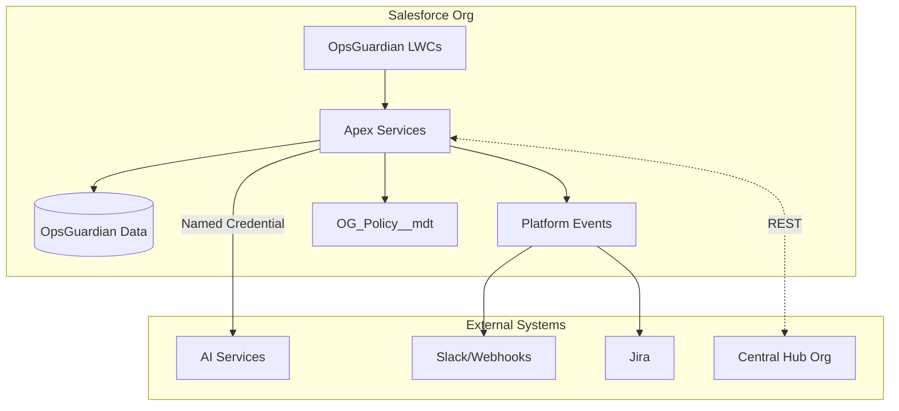

# Sentinel

**The AI Compliance Brain for Salesforce — Configuration drift detection, audit evidence automation, and intelligent compliance analysis for regulated organizations.**

*Current: v1.0 — Compliance Drift Guardrail | Evolving: AI Compliance Intelligence Platform*

<div align="center">

[](LICENSE)
[](https://developer.salesforce.com)
[](.github/workflows)

[Quick Start](#quick-start) • [Sample Report](examples/compliance-baseline-report-sample.md) • [Who It's For](#who-its-for) • [Roadmap](#roadmap)

</div>

---

## What is Sentinel?

Sentinel makes your Salesforce org **audit-ready and protected from configuration drift** in 24 hours.

**Today (v1.0)**: Sentinel continuously monitors your Salesforce configuration for compliance violations, permission sprawl, and undocumented changes — then generates audit evidence and a baseline compliance report that regulators actually want to see.

**Tomorrow (v1.5+)**: Sentinel evolves into an **AI Compliance Brain** that doesn't just detect drift, but interprets the *intent, impact, and compliance reasoning* behind every change — answering questions no other tool can answer.

**Think of it as**: Your AI compliance analyst that works 24/7, understands regulatory frameworks, and speaks both technical and auditor language.

---

## Why This Exists

- **Audits fail** because nobody can explain who changed what and why
- **Regulated orgs** can't afford Salesforce misconfigurations or permission sprawl
- **Existing tools** are too complex/expensive or not tailored to nonprofits and smaller regulated teams
- **Sentinel** gives them a simple, opinionated compliance guardrail + evidence engine

---

## Who It's For

Sentinel is built for **regulated organizations using Salesforce**:

- 🏥 **Healthcare**: HIPAA compliance, PHI protection, audit trails
- 🏛️ **Government & Nonprofits**: FedRAMP, FISMA, grants management, donor privacy
- 💰 **Financial Services**: SOX, PCI-DSS, transaction auditing
- 🏢 **Any Regulated Org**: SOC 2, GDPR, or compliance frameworks requiring audit evidence

If you're spending weeks preparing for audits, manually reviewing permissions, or can't explain recent configuration changes — Sentinel is for you.

---

## What v1 Does Today

### 1. **Compliance Baseline Scan** 📊

Generates a comprehensive compliance baseline report showing:
- Audit Readiness Score (0-100)
- Top 5 compliance risks ranked by severity
- Permissions overview (who has access to what)
- Sharing rules and data access analysis
- Compliance checklist (HIPAA, SOC 2, GDPR, etc.)

**📄 [View Sample Report](examples/compliance-baseline-report-sample.md)**

### 2. **Configuration Drift Detection** 🔍

Tracks Salesforce metadata changes in real-time:
- Profile & permission set modifications
- Sharing rule changes
- Object & field-level security updates
- Setup changes without change control tickets
- Unreviewed production changes

**Alerts you when**: High-risk changes happen (e.g., "Modify All Data" permission granted)

### 3. **Audit Evidence Export** 📁

Automatically collects audit evidence:
- Setup Audit Trail exports
- Field History Tracking data
- Event Monitoring logs (if Shield is enabled)
- Permission set assignment history
- Correlation IDs for tracing changes across systems

**Export formats**: Markdown, CSV, JSON for compliance documentation

### 4. **Audit Readiness Score** 🎯

Calculates a compliance score based on:
- Permission sprawl (how many users have elevated access)
- Audit trail coverage (% of objects with field history enabled)
- Configuration drift (# of unreviewed changes)
- Policy violations (OWD too permissive, no encryption, etc.)

**Score updates**: Real-time as you fix issues

---

## What v1 Does NOT Do (Non-Goals)

To keep Sentinel simple and focused, v1 intentionally:

- ❌ **Does not replace SIEM**: Not a generic security information & event management tool
- ❌ **Does not monitor every SaaS**: Salesforce only (multi-SaaS is v2+)
- ❌ **Does not do complex AI governance**: AI-powered change explanations are v1.5+
- ❌ **Does not prevent changes**: It detects and alerts; it doesn't block (approval workflows are future work)

Sentinel is a **compliance drift detector**, not a full GRC platform.

---

## The Future: AI Compliance Intelligence

Sentinel is evolving into the world's first **AI Compliance Brain** — a system that doesn't just detect drift, but **interprets the meaning, intent, and compliance impact** of every change.

**Vision**: Intelligence, not dashboards.

Where competitors show logs, Sentinel will provide judgment, context, and compliance reasoning.

### Coming in v1.5 (Q2 2025) — AI-Assisted Remediation

#### **Change Intent Analysis** 🧠
The signature feature that sets Sentinel apart — AI that understands the *why* behind every change:

**What competitors show**:
```
Permission Set "Financial_Data_Access" modified by j.smith@acme.org
```

**What Sentinel shows**:
```
⚠️ High-Risk Change Detected

Change: Permission Set "Financial_Data_Access" modified
Changed By: j.smith@acme.org
Risk Score: 8.7/10

AI Analysis:
This change grants 45 users "Modify All Data" permission, which:
• Violates SOC2-CC6.3 (logical access controls)
• Expands donor-data exposure by 340%
• Bypasses approval workflow for financial records
• Fails HIPAA "minimum necessary" access rule (§164.514(d))

Compliance Impact:
- HIPAA: ❌ Non-compliant
- SOC 2: ❌ Control failure (CC6.1)
- SOX: ❌ Segregation of duties violation

Recommended Fix:
Create granular permission set with access to:
- Financial_Transactions__c (Read/Edit only)
- Account.AnnualRevenue (Read only)

Evidence Generated: Attached to audit trail
```

This level of reasoning is **impossible for competitors to match** without rebuilding their entire platform.

#### **Automated Remediation Suggestions** 🛠️
One-click fixes for common compliance violations:
- Remove stale permission set assignments (users inactive >90 days)
- Revert OWD settings to "Private" when changed without approval
- Re-enable Field History Tracking on compliance-sensitive objects

#### **Jira Integration** 🎫
Auto-create tickets for high-risk changes with full compliance evidence attached.

---

### Coming in v2.0 (Q4 2025) — Multi-Org Governance

#### **Compliance Co-Pilot** 🤖
Natural language interface for compliance queries:

```
You: "Show me all risky flows touching PII"
Sentinel: [Displays 12 flows with PII exposure risks, ranked by severity]

You: "Generate SOC2 evidence for Q2"
Sentinel: [Exports audit-ready PDF with all Q2 evidence]

You: "Why did our readiness score drop from 87 to 72?"
Sentinel: "3 high-risk changes detected:
1. 23 users granted 'View All Data' without approval
2. Patient_Records__c sharing changed to Public Read/Write
3. Shield Platform Encryption disabled on SSN__c field"
```

#### **Cross-CRM Unified Governance** 🌐
One compliance model across all your CRMs:
- Salesforce
- HubSpot
- Dynamics 365
- Zendesk
- ServiceNow
- Custom apps

**The Moat**: Once Sentinel builds this unified compliance graph, competitors cannot catch up without 3-4 years of development.

#### **Predictive Risk Modeling** 📈
Proactive alerts before violations happen:

```
⚡ Predictive Alert

Based on recent admin behavior and automation dependencies,
the upcoming Flow deployment has an 87% probability of causing
HIPAA access violations.

Suggested Action: Review Flow permissions before deployment.
```

---

### Why This Matters — Sentinel's Uncopyable Differentiators

1. **AI Change Intent Analysis** — Competitors show *what* changed; Sentinel explains *why it matters*
2. **Automated Compliance Mapping** — Instant mapping to SOC2, HIPAA, NIST, FedRAMP, GDPR
3. **Evidence Packs** — Auto-generated, auditor-ready documentation
4. **Cross-CRM Intelligence** — Unified compliance model (impossible to copy quickly)
5. **Nonprofit-Focused** — Purpose-built for regulated nonprofits (underserved market)

**No one else is building this.**

[See full roadmap →](ROADMAP.md)

---

## Quick Start

### Prerequisites

- Salesforce org (Production, Sandbox, or Scratch Org)
- Salesforce CLI (`sf` or `sfdx`) installed
- DevHub org authenticated (for scratch orgs)

### Installation

#### Option 1: Deploy to Existing Org

```bash
# Clone the repo
git clone https://github.com/YOUR_USERNAME/sentinel.git
cd sentinel

# Authenticate to your Salesforce org
sf org login web --alias myorg

# Deploy the package
sf project deploy start --target-org myorg

# Assign permissions
sf org assign permset --name Sentinel_Admin --target-org myorg

# Open the org
sf org open --target-org myorg
```

#### Option 2: Create Scratch Org (for testing)

```bash
# Run the initialization script
./scripts/orgInit.sh

# This will:
# - Create a 7-day scratch org
# - Push source code
# - Assign Sentinel_Admin permission set
# - Open the org in your browser
```

### Run Your First Compliance Scan

1. **Navigate to Sentinel** in the App Launcher
2. **Click "Run Baseline Scan"** on the dashboard
3. **Wait 30-60 seconds** while Sentinel analyzes your org
4. **View your Audit Readiness Score** and top risks
5. **Export the report** (Markdown or PDF) for your compliance team

---

## Core Features in Detail

### Compliance Baseline Scan

**What it does**: Scans your Salesforce org's configuration and generates a compliance baseline report.

**What it scans**:
- Profiles and Permission Sets (elevated permissions, stale assignments)
- Sharing Rules and OWD settings (over-permissioned objects)
- Object and Field-Level Security (sensitive data exposure)
- Audit Trail configuration (Field History, Event Monitoring)
- Platform Encryption status (Shield enabled/disabled)

**How to use**:
```apex
// Programmatically trigger a scan
ComplianceBaselineScanner scanner = new ComplianceBaselineScanner();
ComplianceReport report = scanner.runScan();
System.debug('Audit Readiness Score: ' + report.getScore());
```

Or use the Lightning Web Component dashboard (navigate to Sentinel app).

---

### Configuration Drift Detection

**What it does**: Monitors Setup Audit Trail and Field History for configuration changes.

**What it tracks**:
- Profile/Permission Set modifications
- Sharing Rule changes
- Custom Object/Field changes
- User permission assignments
- Integration/Connected App changes

**How it works**:
1. **Platform Events**: Sentinel listens to Salesforce Platform Events for real-time changes
2. **Scheduled Jobs**: Runs hourly to poll Setup Audit Trail API
3. **Risk Scoring**: Each change is scored based on impact (Critical/High/Medium/Low)
4. **Alerting**: High-risk changes trigger Slack/email notifications

**Sample alert**:
```
⚠️ Sentinel Drift Alert

Change: Permission Set Modified
Object: Financial_Data_Access
Changed By: j.smith@acme.org
Risk Level: 🔴 High
Reason: Grants "Modify All Data" without change control ticket
Action Required: Review and approve or rollback
```

**Schedule automatic scans**:
```bash
# Run this script to schedule hourly drift detection
./scripts/scheduleApiSnapshot.sh myorg
```

---

### Audit Evidence Export

**What it does**: Collects and exports audit evidence required by auditors.

**Evidence collected**:
- Setup Audit Trail (last 180 days)
- Field History records for compliance-sensitive objects
- Permission set assignment changes
- Login history and session activity (if Event Monitoring enabled)

**Export formats**:
- **Markdown**: Human-readable reports
- **CSV**: For import into GRC tools
- **JSON**: For SIEM integration

**Export a compliance report**:
```bash
# Using Salesforce CLI
sf apex run --file scripts/exportEvidenceReport.apex --target-org myorg

# Or use the LWC dashboard
# Navigate to Sentinel → Reports → Export Compliance Evidence
```

---

### Audit Readiness Score

**How it's calculated**:

| Factor | Weight | Criteria |
|--------|--------|----------|
| **Permission Sprawl** | 30% | # of users with "Modify All" or "View All" permissions |
| **Audit Trail Coverage** | 25% | % of compliance-sensitive objects with Field History enabled |
| **Configuration Drift** | 20% | # of unreviewed high-risk changes in last 30 days |
| **Encryption Status** | 15% | Shield Platform Encryption enabled for PHI/PII fields |
| **Policy Compliance** | 10% | OWD settings, session timeout, password policy |

**Example score calculation**:
```
Base Score: 100

Deductions:
- 127 users with "Modify All Data": -20 points
- Field History not enabled on Patient_Records__c: -10 points
- 34 unreviewed changes: -15 points
- Shield Platform Encryption disabled: -10 points
- OWD set to "Public Read/Write" on 2 objects: -8 points

Final Score: 100 - 63 = 37/100 (🔴 Critical)
```

**Improving your score**:
1. Follow the "Suggested Actions" in your baseline report
2. Re-run the scan after making changes
3. Track score improvements over time

---

## Dashboard Components

Sentinel includes Lightning Web Components for real-time monitoring:

### 1. **System Monitor Dashboard**
- Governor limit tracking (CPU, Heap, SOQL, DML)
- Real-time alerts when limits are approaching
- Historical trending

**Location**: `force-app/main/default/lwc/systemMonitorDashboard/`

### 2. **API Usage Dashboard**
- API call consumption tracking
- Predict when you'll hit API limits
- Integration health monitoring

**Location**: `force-app/main/default/lwc/apiUsageDashboard/`

### 3. **Flow Execution Monitor**
- Track Flow runs, faults, and performance
- Identify slow or failing automations
- Audit trail for business logic changes

**Location**: `force-app/main/default/lwc/flowExecutionMonitor/`

### 4. **Performance Alert Panel**
- Real-time alerts for threshold breaches
- Configurable alert rules
- Integration with Slack/Jira

**Location**: `force-app/main/default/lwc/performanceAlertPanel/`

---

## Configuration

### Sentinel Settings

Configure compliance thresholds in **Sentinel Settings** (Custom Settings):

| Setting | Description | Default |
|---------|-------------|---------|
| `CPU_Warn__c` | CPU time warning threshold (ms) | 8000 |
| `CPU_Crit__c` | CPU time critical threshold (ms) | 9500 |
| `Heap_Warn__c` | Heap size warning threshold (KB) | 10000 |
| `Heap_Crit__c` | Heap size critical threshold (KB) | 11500 |
| `SOQL_Warn__c` | SOQL query warning threshold | 80 |
| `SOQL_Crit__c` | SOQL query critical threshold | 95 |

**Access**: Setup → Custom Settings → Sentinel Settings → Manage

### Alert Integrations

Sentinel supports multiple alert channels:

#### Slack Integration

1. Create a Slack Webhook URL: https://api.slack.com/messaging/webhooks
2. Setup → Named Credentials → New Named Credential
   - Label: `Slack_Webhook`
   - URL: Your Slack webhook URL
3. Test the integration:
   ```apex
   SlackNotifier.notifyAsync('🚨 Test alert from Sentinel');
   ```

#### Jira Integration (Future)

Coming in v1.5 — automatically create Jira tickets for high-risk changes.

---

## Development

### Project Structure

```
sentinel/
├── force-app/main/default/          # Salesforce code
│   ├── classes/                     # Apex classes
│   │   ├── ApiUsageSnapshot.cls     # API usage tracking
│   │   ├── PerformanceRuleEngine.cls # Alert rule evaluation
│   │   ├── FlowExecutionLogger.cls  # Flow monitoring
│   │   └── SlackNotifier.cls        # Alert notifications
│   ├── lwc/                         # Lightning Web Components
│   │   ├── systemMonitorDashboard/  # Real-time monitoring UI
│   │   ├── apiUsageDashboard/       # API usage dashboard
│   │   └── flowExecutionMonitor/    # Flow tracking UI
│   ├── objects/                     # Custom Objects & Settings
│   │   ├── CCX_Settings__c/         # Configuration (API name preserved)
│   │   ├── Flow_Execution__c/       # Flow run data
│   │   └── Performance_Alert_History__c/ # Alert history
│   └── permissionsets/              # Permission sets
│       └── Sentinel_Admin.permissionset-meta.xml
├── scripts/                         # Automation scripts
│   ├── orgInit.sh                   # Scratch org initialization
│   └── scheduleApiSnapshot.sh       # Schedule periodic scans
├── config/                          # Salesforce project config
│   └── project-scratch-def.json     # Scratch org definition
├── examples/                        # Sample outputs
│   └── compliance-baseline-report-sample.md
├── docs/                            # Documentation
└── README.md
```

### Running Tests

```bash
# Run all Apex tests
sf apex run test --target-org myorg --code-coverage --result-format human

# Run specific test class
sf apex run test --target-org myorg --tests PerformanceRuleEngineTest

# Current test coverage: 95%+
```

### Code Quality

```bash
# Format code
npm run fmt

# Check formatting
npm run fmt:check

# Run linter
npm run lint
```

---

## Roadmap

### ✅ v1.0 (Current) - Compliance Drift Baseline

- [x] Compliance Baseline Scan
- [x] Configuration Drift Detection
- [x] Audit Evidence Export
- [x] Audit Readiness Score
- [x] Slack alerting
- [x] LWC dashboards (governor limits, API usage, Flow monitoring)

### 🚧 v1.5 (Next 3-6 months) - AI-Assisted Remediation

- [ ] **AI Change Explanations**: GPT/Claude integration to explain why a change is risky
- [ ] **Suggested Fixes**: Auto-generate remediation steps (e.g., "Create permission set to replace 'Modify All'")
- [ ] **Jira Integration**: Auto-create tickets for high-risk changes
- [ ] **Compliance Report Scheduler**: Email weekly/monthly reports to compliance team
- [ ] **Mobile Alerts**: Push notifications for critical drift events

### 🔮 v2.0 (6-12 months) - Multi-Org Governance

- [ ] **Multi-Org Dashboard**: Monitor compliance across production, sandboxes, dev orgs
- [ ] **Centralized Evidence Repository**: Store audit evidence from multiple orgs in a single location
- [ ] **AI Governance**: Track Einstein/AI feature usage and compliance (e.g., GDPR Article 22)
- [ ] **SIEM Export**: Push events to Splunk, DataDog, or other SIEM tools
- [ ] **Custom Compliance Frameworks**: Define your own compliance rules beyond HIPAA/SOC 2

### 🌟 v3.0+ (Future) - Automated Remediation

- [ ] **Auto-Remediation**: Automatically fix common drift issues (e.g., remove stale permission sets)
- [ ] **Change Control Workflows**: Require approval before high-risk changes go live
- [ ] **Policy-as-Code**: Define compliance policies in YAML, enforce via CI/CD
- [ ] **AppExchange Listing**: Publish as managed package for easy installation

---

## FAQ

### Q: Does Sentinel prevent users from making non-compliant changes?

**A**: Not in v1. Sentinel **detects** and **alerts** on drift, but doesn't block changes. Automated remediation and approval workflows are planned for v2+.

### Q: Does Sentinel require Shield Platform Encryption?

**A**: No, but it will flag missing encryption as a compliance risk in your baseline report. If you need HIPAA or SOX compliance, Shield is strongly recommended.

### Q: Can I use Sentinel in a sandbox?

**A**: Yes! We recommend testing in a sandbox first. Sentinel works in Production, Sandbox, Scratch Orgs, and Developer Orgs.

### Q: Does Sentinel store data outside Salesforce?

**A**: No. All data stays in your Salesforce org. Sentinel does not send data to external servers (except for Slack/Jira if you configure those integrations).

### Q: What about GDPR compliance?

**A**: Sentinel helps with GDPR by tracking access to personal data and providing audit evidence. See the [Compliance section in the full README](docs/compliance-frameworks.md) for details.

### Q: Can I customize the Audit Readiness Score calculation?

**A**: Not yet. Custom scoring is planned for v2. For now, the score is based on industry best practices (NIST 800-53, HIPAA, SOC 2).

---

## Contributing

Sentinel is under active development. Contributions welcome!

**Priority areas for v1**:
- Additional compliance framework support (ISO 27001, FedRAMP)
- Improved drift detection rules
- Test coverage for edge cases
- Documentation improvements

See [CONTRIBUTING.md](CONTRIBUTING.md) for guidelines.

---

## License

MIT License - see [LICENSE](LICENSE) file for details.

---

## Support

- **Documentation**: [docs/](docs/)
- **Sample Reports**: [examples/](examples/)
- **Issues**: [GitHub Issues](https://github.com/YOUR_USERNAME/sentinel/issues)
- **Discussions**: [GitHub Discussions](https://github.com/YOUR_USERNAME/sentinel/discussions)

---

## Rename This Repo

**Important**: This repository should be renamed to better reflect its purpose.

**Current name**: `Ops-Gurdian` or `Sentinel`
**Recommended name**: `sentinel-salesforce-compliance-drift-guard`

**To rename**:
1. Go to Settings → General → Repository name
2. Change to: `sentinel-salesforce-compliance-drift-guard`
3. Update the short description to:
   > "Compliance-first Salesforce configuration drift guardrail and audit evidence engine for regulated orgs."
4. Add GitHub topics: `salesforce`, `compliance`, `audit`, `security`, `governance`, `drift-detection`, `nonprofit`, `regulated-industries`, `hipaa`, `sox`, `soc2`, `gdpr`

---

*Sentinel™ — Keep your Salesforce org audit-ready, every day.*


> Enterprise-grade observability and compliance guardrails for Salesforce orgs.  
> **Outcomes:** fewer outages, faster incident triage, cleaner audits, and predictable releases.

[](../../actions)
[](LICENSE)

---

## Why OpsGuardian

Modern Salesforce programs need **reliable telemetry** (limits, flows, APIs), **policy enforcement** (thresholds & alerts), and **production-safe automation**. OpsGuardian packages these into a **lightweight managed pattern** that you can adopt incrementally—no lock-in, no black boxes.

**Who it's for**

- **Admins / Platform Owners** — prevent limit breaches, see flow failures, speed root-cause.
- **Sec/GRC** — retention, encryption patterns, audit-ready logs & access controls.
- **DevOps** — pre-flight checks, test coverage views, deploy health, hub-and-spoke ingest.

---

## Feature Highlights

- **Real-time Performance Signals**: CPU/heap/SOQL/DML usage, Flow runs & faults, Async job health.
- **Policy Thresholds**: Simple Custom Metadata (`OG_Policy__mdt`) to define warn/critical limits.
- **Alerts & Routing**: Platform Events → Slack/Webhooks/Jira via plugin interface.
- **Dashboards**: API usage, flow health, deployment/test insights (Lightning app).
- **Hub-and-Spoke**: Optional REST ingest to centralize events from many orgs.
- **Security by Default**: CRUD/FLS checks, `WITH SECURITY_ENFORCED`, Shield-friendly data model.
- **Extensible**: Drop-in plugins; no changes to core package required.

---

## Architecture



⸻

## Requirements

- Salesforce API 63.0+ (tested through 65.0, Winter '26)
- Salesforce CLI (sf), Dev Hub enabled
- Node.js 18+ (for LWC tests/linting)
- (Recommended) Shield Platform Encryption in production orgs

⸻

## Quick Start

**A) Scratch Org (dev sandbox)**

```bash
# 1) Authenticate Dev Hub (one time)
sf org login web --set-default-dev-hub --alias DevHub

# 2) Create a scratch org
sf org create scratch \
  --definition-file config/project-scratch-def.json \
  --alias OG-Dev --duration-days 7 --set-default

# 3) Deploy the project
sf project deploy start

# 4) Assign admin permset and open the org
sf org assign permset --name Command_Center_Admin
sf org open
```

After opening the org, use the App Launcher to pin the API Usage, Flow Execution, Deployment Job, and Performance Alert History tabs (no managed Lightning app is packaged yet).

**B) Sandbox / Production**

- Install the managed package (coming soon). Until then, deploy via `sf project deploy start` to a sandbox.
- Assign `Command_Center_Admin`.
- Configure policies under Setup → Custom Metadata Types → `OG_Policy__mdt`.
- (Optional) Set up Named Credentials for Slack/Webhooks/AI.

⸻

## Configuration

### Policy Thresholds (`OG_Policy__mdt`)

| Field               | Type   | Example | Purpose                       |
| ------------------- | ------ | ------- | ----------------------------- |
| `CPU_Warn__c`       | Number | 5000    | CPU warn (ms)                 |
| `CPU_Crit__c`       | Number | 8000    | CPU critical (ms)             |
| `SOQL_Warn__c`      | Number | 80      | SOQL warn                     |
| `SOQL_Crit__c`      | Number | 95      | SOQL critical                 |
| `DML_Warn__c`       | Number | 120     | DML rows warn                 |
| `DML_Crit__c`       | Number | 150     | DML rows critical             |
| `Retention_Days__c` | Number | 180     | History retention for cleanup |

Tip: create a "Default" record and org/BU-specific overrides as needed.

### Alerts (Slack/Webhook)

1. Setup → Named Credentials → New
   - Name: `Slack_Webhook`
   - URL: Incoming webhook URL
2. Use the provided notifier (see Plugins) or your own.

⸻

## Using OpsGuardian

### Dashboards (via tabs/App Launcher)

- API Usage
- Flow Health
- System Performance
- Deploy/Test Monitor
- Performance Alerts

### Investigate Critical Events (SOQL)

```sql
SELECT Event_Type__c, Severity__c, Message__c, Timestamp__c, Correlation_Id__c
FROM OpsGuardian_History__c
WHERE Severity__c = 'Critical'
ORDER BY Timestamp__c DESC
LIMIT 50
```

### REST Ingest (Hub-and-Spoke)

- Endpoint: `/services/apexrest/og/v1/ingest`
- Auth: JWT Bearer via Named Credential

**Body**

```json
{
  "type": "CPU",
  "message": "CPU limit exceeded",
  "severity": "Critical",
  "timestamp": "2025-01-15T10:30:00Z",
  "correlationId": "a1b2c3d4"
}
```

**cURL**

```bash
curl -X POST "$SF_URL/services/apexrest/og/v1/ingest" \
  -H "Authorization: Bearer $JWT" \
  -H "Content-Type: application/json" \
  -d '{"type":"CPU","message":"CPU limit exceeded","severity":"Critical","timestamp":"2025-01-15T10:30:00Z"}'
```

Responses: 201 OK • 400 Invalid • 401 Unauthorized • 429 Rate limited (with Retry-After)

⸻

## Plugin SDK

Create an outbound integration by implementing a simple interface and registering it via Custom Metadata (`OG_Plugin_Config__mdt`).

```apex
public interface OG_Plugin {
    void send(OpsGuardian_History__c eventRec);
    Boolean supports(String eventType, String severity);
}

public class SlackPlugin implements OG_Plugin {
    public void send(OpsGuardian_History__c evt) {
        HttpRequest req = new HttpRequest();
        req.setMethod('POST');
        req.setEndpoint('callout:Slack_Webhook');
        req.setHeader('Content-Type', 'application/json');
        req.setBody(JSON.serialize(evt));
        new Http().send(req);
    }
    public Boolean supports(String type, String severity) {
        return severity == 'Critical';
    }
}
```

Register via `OG_Plugin_Config__mdt` with `Class_Name__c = SlackPlugin`.

⸻

## Security & Compliance

### STRIDE at a Glance

| Threat                 | Control                                                 |
| ---------------------- | ------------------------------------------------------- |
| Spoofing               | JWT validation, audience checks                         |
| Tampering              | `WITH SECURITY_ENFORCED`, `Security.stripInaccessible`  |
| Repudiation            | Append-only logs, correlation IDs                       |
| Information Disclosure | CRUD/FLS, Shield encryption at rest                     |
| DoS                    | 429 w/ Retry-After, platform cache, governor safeguards |
| Elevation of Privilege | Least-privilege perm sets, with sharing classes         |

### Data Privacy

- Encryption: TLS 1.2/1.3 in transit; Shield at rest (if enabled).
- Retention: Default 180 days (configurable).
- Erasure: Admin-triggered anonymization Flow included.

Report security issues via GitHub Security Advisories. Please do not open public issues for vulnerabilities.

⸻

## Performance (reference env)

| Scenario                  | P50   | P95    | Notes                       |
| ------------------------- | ----- | ------ | --------------------------- |
| Ingest API (per request)  | 90ms  | 180ms  | Queueable insert            |
| Dashboard refresh         | 600ms | 1200ms | Indexed queries + LDS cache |
| Risk scoring (1K records) | 120ms | 250ms  | Baseline heuristic          |

Test org: Enterprise Edition, ~1M history rows, ~10k events/hour.

⸻

## Development

```bash
# Clone
git clone https://github.com/derickporter1993/Ops-Gurdian.git
cd Ops-Gurdian

# Node deps (LWC/Jest/Eslint)
npm install

# Run tests & linters
npm test
npm run lint
npm run fmt

# Apex tests & coverage
sf apex run test --test-level RunLocalTests --code-coverage --result-format human

# Static analysis
sf scanner run --target force-app --format table
```

**Branching & Commits**

- `main`: release branch
- `dev`: integration branch
- Feature branches: `feat/<key>-short-desc`
- Conventional commits (`feat:`, `fix:`, `chore:`, `docs:`…)

⸻

## Roadmap

- AppExchange listing (managed package)
- Multi-language dashboards (ES/FR/DE)
- Anomaly detection (ML)
- Observability exports (Grafana/Datadog)
- Custom report builder
- Mobile (Salesforce Mobile SDK)

⸻

## Support

- Bugs/requests: GitHub Issues
- Security: Security Advisories
- Discussions: GitHub Discussions (if enabled)

⸻

## License & Notices

MIT © Derick Brian Porter.  
Salesforce and related marks are trademarks of salesforce.com, inc. OpsGuardian is an independent project and not an official Salesforce product.

---
