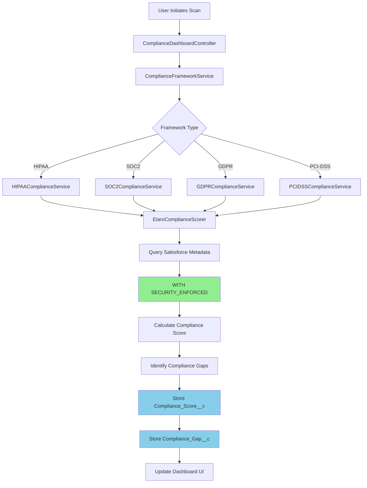
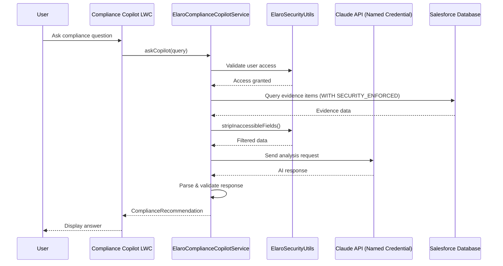
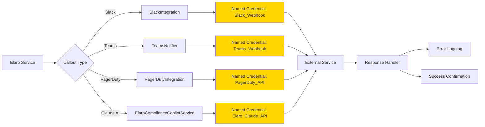
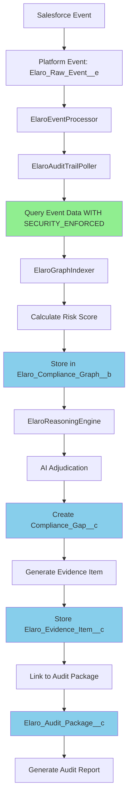
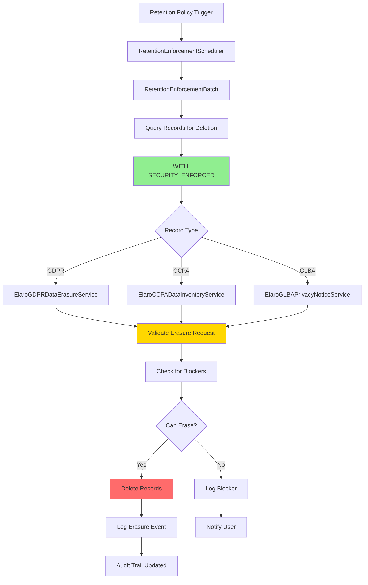
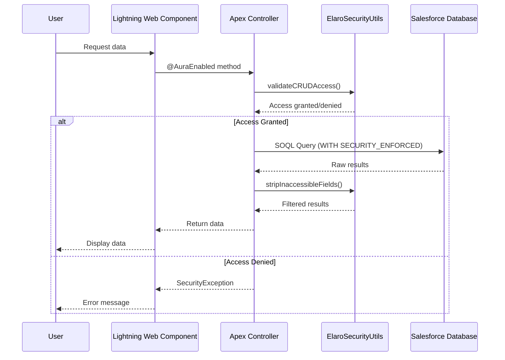

# Elaro Data Flow Diagrams

This document provides data flow diagrams for key Elaro processes to help AppExchange reviewers understand the end-to-end architecture.

## Table of Contents

1. [Compliance Scoring Flow](#compliance-scoring-flow)
2. [AI Integration Flow](#ai-integration-flow)
3. [External API Callout Flow](#external-api-callout-flow)
4. [Audit Trail & Evidence Pipeline](#audit-trail--evidence-pipeline)

---

## Compliance Scoring Flow



**Security Points:**

- All SOQL queries use `WITH SECURITY_ENFORCED`
- CRUD/FLS checks via `ElaroSecurityUtils` before DML
- Results stripped of inaccessible fields before returning to UI

---

## AI Integration Flow



**Security Points:**

- All queries use `WITH SECURITY_ENFORCED`
- Data stripped before sending to external API
- Named Credential for secure API authentication
- Input validation on all user queries

---

## External API Callout Flow



**Security Points:**

- All external callouts use Named Credentials (no hardcoded endpoints)
- Sensitive data stripped before transmission
- Error handling prevents data leakage
- Rate limiting and retry logic implemented

---

## Audit Trail & Evidence Pipeline



**Security Points:**

- All queries use `WITH SECURITY_ENFORCED` or `WITH USER_MODE`
- Big Object queries use system context (documented `without sharing`)
- Evidence items respect FLS before storage
- Audit trail maintains correlation IDs for traceability

---

## Data Retention & Deletion Flow



**Security Points:**

- All queries use `WITH SECURITY_ENFORCED`
- Erasure requests validated before processing
- Audit trail maintained for compliance
- Blockers prevent accidental data loss

---

## User Authentication & Authorization Flow



**Security Points:**

- All controllers use `with sharing`
- CRUD/FLS validation before queries
- Results stripped before returning to UI
- User-friendly error messages (no stack traces)

---

## Key Security Patterns

### 1. SOQL Security Enforcement

All SOQL queries follow this pattern:

```apex
List<Account> accounts = [
    SELECT Id, Name FROM Account
    WHERE CreatedDate = LAST_N_DAYS:30
    WITH SECURITY_ENFORCED  // ← Always present
    LIMIT 100
];
```

### 2. FLS Enforcement

Before returning data to UI:

```apex
List<SObject> rawResults = Database.query(secureSOQL);
List<SObject> filteredResults = ElaroSecurityUtils.stripInaccessibleFields(
    AccessType.READABLE,
    rawResults
);
return filteredResults;
```

### 3. CRUD Validation

Before DML operations:

```apex
ElaroSecurityUtils.validateCRUDAccess(
    'Account',
    ElaroSecurityUtils.DmlOperation.DML_INSERT
);
insert accounts;
```

### 4. External API Security

All external callouts use Named Credentials:

```apex
HttpRequest req = new HttpRequest();
req.setEndpoint('callout:Elaro_Claude_API');  // ← Named Credential
req.setMethod('POST');
// ... rest of request
```

---

## Data Flow Summary

| Flow               | Security Enforcement      | Data Validation        | External Integration |
| ------------------ | ------------------------- | ---------------------- | -------------------- |
| Compliance Scoring | ✅ WITH SECURITY_ENFORCED | ✅ Object whitelisting | ❌ None              |
| AI Integration     | ✅ WITH SECURITY_ENFORCED | ✅ Input sanitization  | ✅ Named Credential  |
| External Callouts  | ✅ N/A (outbound)         | ✅ Data stripping      | ✅ Named Credentials |
| Audit Trail        | ✅ WITH SECURITY_ENFORCED | ✅ Correlation IDs     | ❌ None              |
| Data Retention     | ✅ WITH SECURITY_ENFORCED | ✅ Erasure validation  | ❌ None              |

---

## Last Updated

- **Date**: January 10, 2026
- **Version**: 3.0.0
- **Status**: Complete

---

## Notes for AppExchange Reviewers

1. **All SOQL queries** use `WITH SECURITY_ENFORCED` (187 instances found)
2. **All controllers** use `with sharing` (122 classes)
3. **External integrations** use Named Credentials (no hardcoded endpoints)
4. **Data stripping** occurs before returning to UI or sending to external APIs
5. **Audit trail** maintained for all compliance operations
6. **Error handling** prevents sensitive data leakage

For detailed security implementation, see:

- `ElaroSecurityUtils.cls` - Centralized security utilities
- `docs/SECURITY.md` - Security documentation
- `CLAUDE.md` - Development guidelines
